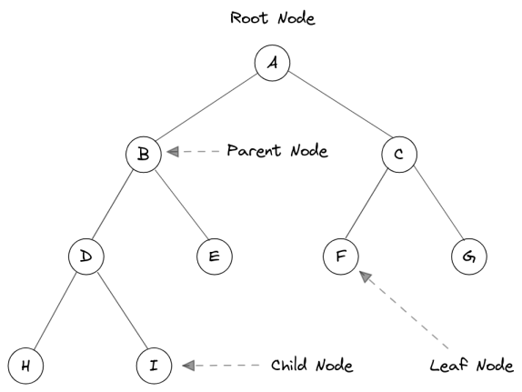

# Visual-Tree

A basic interactive tree visualization library that can be used to render different types of tree structures. 

[](https://nodejs.org)
[](https://www.npmjs.com/package/visual-tree)
[](https://github.com/m-elbably/visual-tree/workflows/visual-tree/badge.svg)
[](https://raw.githubusercontent.com/m-elbably/visual-tree/master/LICENSE)

## Installation
    npm install visual-tree --save

## Features
- Custom node with icon and title
- Collapse and expand child nodes
- Add and insert new nodes
- Remove single node and remove node with children
- Insert new nodes between nodes
- Zoom in & Zoom Out
- Zoom fit to view port
- Select and highlight nodes
- Search for node
- Keyboard navigation support
- Highlight path to node
- Toggle to fullscreen
- Export tree to image

## Overview

A tree visualization displays hierarchical data with a collection of nodes (data points that can store value or whole object) and edges (hierarchical relations between nodes).



### Basic Terminologies

- **Root Node**: The topmost node of a tree or the node which does not have any parent node. There is only one root per tree and one path from the root node to any node.
- **Parent Node**: Any node except the root node has one edge upward to a node called parent.
- **Child Node**: The node which is the immediate successor of another node (connected below a given node).
- **Leaf Node**: (External Node) The node which do not have any child nodes are called leaf nodes.
- **Traversing**: Traversing means passing through nodes in a specific order.

## Usage

### Initial Setup

1. Create a new `div` element with specific `id` to be used as canvas container
```javascript
<div id="visual-tree-container"></div>
```
2. Create visual tree instance and add new node
```javascript
// Create visual tree instance
var element = document.getElementById("visual-tree-container");
var visualTree = new VisualTree(element);

// Create new Nodes
var root = new Node({
    id: "0",
    name: "Home",
    icon: '/public/assets/home.png',
    textColor: '#ffffff',
    backgroundColor: '#1e981e'
});

var node = new Node({
    id: "1",
    name: "Child Node"
});

// Add nodes
visualTree.add(root);
visualTree.add(node, root);

// Finally render tree
visualTree.render();
```

### Control View
```javascript
// Zoom in
visualTree.zoomIn();
// Zoom out
visualTree.zoomOut();
// Zoom fit
visualTree.zoomFit();
// Zoom reset (Scale 1 and center in viewport)
visualTree.zoomReset();
// Toggle fullscreen
visualTree.toggleFullScreen();
```

### Control Nodes
```javascript
// Get selected node
var selected = visualTree.selectedNode;
// Select node by id
visualTree.selectNode("12");
// Reset selection
visualTree.resetSelection();

// Highlight node
node.highlighted = true;
// Reset all nodes highlight
visualTree.resetHighlight();

// Add child node to parent A
visualTree.add(new Node({id: "1", name: "child"}), A);
// Insert node between node "A" as parent and "B" as a child 
visualTree.add(new Node({id: "1", name: "child"}), A, B);

// Remove single node
visualTree.remove(selected, false);
// Remove node with its children
visualTree.remove(selected, true);

// Show node within viewport
visualTree.panToNode(node);
// Select edges between start and end nodes
visualTree.selectPath(startNodeId, endNodeId);
// Reset edges selection
visualTree.resetPathsSelection();
```

### Highlight edges between nodes

We can highlight edges `path` between 2 nodes, and the library will traverse the tree between nodes to select the edges.

- To highlight path between 2 nodes we need to call `selectPath` and pass start node id and end node id
- To reset edges highlight we need to call `resetPathsSelection` function.
```javascript
visualTree.selectPath(root.id, endNode.id);
// To reset highlight
visualTree.resetPathsSelection();
```

### Search for and highlight nodes
```javascript
function searchForNodes(term) {
    if(term.length === 0) {
        // Reset current highlighted nodes
        return visualTree.resetHighlight();
    }

    // Very basic search method
    // You can implement whatever you need
    Object.values(visualTree.nodes).forEach((node) => {
        if(node.name.indexOf(term) >= 0) {
            node.highlighted = true;
        } else {
            node.highlighted = false;
        }
    });
}
```

### Show hide toggle button
```javascript
// Show/Hide collapse and expand button (Toggle Button)
visualTree.setToggleButtonVisibility(false); // default = true
```

### Listening to mouse move event
```javascript
visualTree.setOnMouseMoveEvent((e) => {
    // Get current node (Node intersects with mouse current position x,y) 
    const node = e['node'];
    
    // Show action button on current hovered node under mouse position
    if(node != null) {
        tree.setActionButtonVisibility(true, node);
    } else {
        tree.setActionButtonVisibility(false);
    }
});
```

## Challenges
-   Canvas Rendering
-   Tree Visualization
-   Keyboard Navigation

### Tree Visualization

We have used the `Reingold-Tilford` tree visualization algorithm.

With current implementation and use case, we need to draw on `x-axis`, so we have done the implementation accordingly, the main challenge here is to determine the `Y` position for each node, also we have variable width and height for nodes, so we've also added some optimizations, for example, to get `max-width` for each column (along `y-axis`) and adjusted node `X` positions accordingly.

Additional details:
- [Reingold-Tilford Original Paper](https://reingold.co/tidier-drawings.pdf)
- [Reingold-Tilford Algorithm Explanation](https://rachel53461.wordpress.com/tag/reingold-tilford/)

### Canvas Rendering

For canvas rendering we use a low-level library **Konva.js** which helps focus on functionalities we need without wasting time with canvas and shape low-level rendering details.

**Konva.js** is an HTML5 2d canvas js library for desktop and mobile applications that can work with ES5, ES6, or even Typescript.

Additional details:
- [Konva Website](https://konvajs.org/)
- [Konva Documentations](https://konvajs.org/api/Konva.html)

### Keyboard Navigation

Keyboard navigation is implemented through considering the tree as a virtual grid (rows, columns) then move along the y-axis using `up` and `down` arrows, or along the x-axis using `right` and `left` arrows.    

## TODO
- [ ] Testing
- [ ] Vertical layout
- [ ] Easy configuration for text and highlight colors
- [ ] Export diagram to pdf
- [ ] Performance optimization
- [ ] Packaging optimization

#### License
MIT
